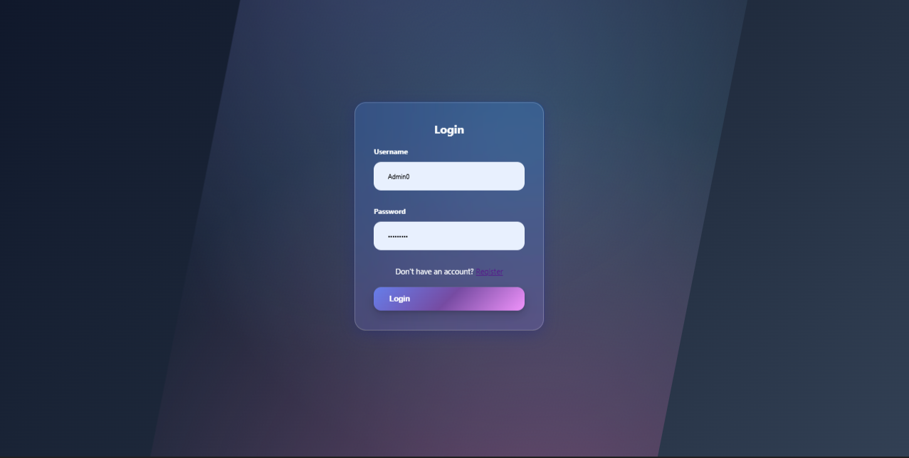

# 📦 Stock Management System

## 🚀 Overview
A full-stack Stock Management System built using Java and Spring Boot, designed to manage products, sales, and users efficiently.

## 🛠 Tech Stack
- Java
- Spring Boot
- Spring Security
- Thymeleaf
- MySQL
- HTML, CSS, JavaScript

## ✨ Features
- 🔐 User Authentication & Authorization
- 📦 Product Management (CRUD)
- 💰 Sales Tracking
- 📊 Dashboard View
- 🧾 MVC Architecture

## 📂 Project Structure
- Controller Layer
- Service Layer
- Repository Layer
- Model Layer

## ⚙️ How to Run
1. Clone the repository  
2. Configure database in `application.properties`  
3. Run the project using:

## 📸 Screenshots

### Login Page

### Dashboard

### Products

## 👨‍💻 Author
Suyog
